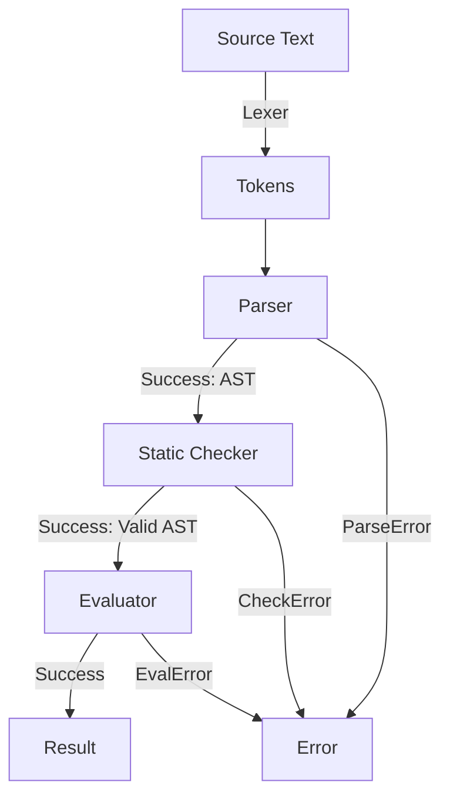

# GoTiny

A tiny statically-typed programming language implemented in Go. GoTiny programs can be written as
scripts and executed directly, with an interactive REPL available for experimenting with
expressions and statements.

## Language Features

### 1. Statically Typed

- **Types:** Supports `Int` and `Bool`, and function types
- **Static Checking:** Type mismatches, undefined variables, duplicate declarations,
  invalid operations, and invalid function calls are detected before evaluation begins.
- **Function Types:** Function parameter and return types are checked statically.

### 2. Operators & Precedence

Expressions follow a strict precedence hierarchy (lowest to highest):

- **Logical OR:** `||` (with short-circuit evaluation)
- **Logical AND:** `&&` (with short-circuit evaluation)
- **Equality:** `==`, `!=`
- **Comparison:** `<`, `<=`, `>`, `>=`
- **Addition/Subtraction:** `+`, `-`
- **Multiplication/Division:** `*`, `/`
- **Unary:** `+`, `-` (for integers) and `!` (for booleans)
- **Primary:** Integer literals, boolean literals, identifiers, and grouped expressions `(...)`

### 3. Variables & Scope

- **Declarations:** Variables are declared using the `let` keyword (e.g., `let x = 1712;`)
- **Assignment:** Existing variables can be reassigned (e.g. `x = 1729;`).
- **Type-safe assignment:** Variables cannot be reassigned a value of a different type.
- **Scope:** Blocks introduce a new scope.
- **Duplicate declarations:** A variable cannot be declared twice in the same scope.
- **Lexical scope:** Functions capture the environment in which they are declared,
  allowing closures to access variables from their surrounding scope.

### 4. Functions

Functions can be declared with typed parameters and a return type:

```gt
fn add(x Int, y Int) Int {
    return x + y;
}
```

Functions support:

- **Parameters:** Functions can accept typed parameters.
- **Return values:** Functions return values using the return statement.
- **Function calls:** A function call is an expression whose type is the function's declared return type.
- **Void functions:** Functions without a return value have a Void return type.
- **Closures:** Functions capture their lexical environment and can access variables from their enclosing scope.
- **Recursion:** Functions can call themselves recursively.
- **Nested returns:** Return statements propagate through nested blocks until the function returns.

## Installation

```
go install github.com/shsiddhant/gotiny/cmd/gotiny@latest
```

## Usage

### Executing Scripts

Pass a script file to execute it directly:

```
gotiny script.gt
```

The repository includes several example programs in the scripts directory.
The main showcase for v0.3.0 is:

`scripts/v0.3.0/showcase.gt`

```gt
fn abs(x Int) Int {
    if x < 0 {
        return -x;
    }
    return x;
}

fn gcd(a Int, b Int) Int {
    if b == 0 {
        return abs(a);
    }
    return gcd(b, a - (a / b) * b);
}

fn max(a Int, b Int) Int {
    if a > b {
        return a;
    }
    return b;
}

fn min(a Int, b Int) Int {
    if a < b {
        return a;
    }
    return b;
}

fn distance(a Int, b Int) Int {
    return abs(a - b);
}

fn analyze(a Int, b Int) Int {
    let common = gcd(a, b);
    let gap = distance(a, b);

    if common == 1 {
        return gap;
    } else {
        return common;
    }
}

let theMonster = 1013;
let theGreenButterfly = 1205;
let detectiveConan = 1224;
let theBestDay = 1217;

let us = min(theMonster, theGreenButterfly);
let anns = max(detectiveConan, theBestDay);


if analyze(theMonster, theGreenButterfly) > analyze(detectiveConan, theBestDay) {
    anns > us;
} else {
    anns - us;
}
```

Run it with:

```
gotiny scripts/v0.3.0/showcase.gt
true
```

The repository contains additional example scripts that can be you can try out.

### Interactive REPL

Run without arguments to launch the REPL:

```
gotiny
```

The REPL is useful for experimenting with expressions and individual statements:

```
> 3 * (1729 - 1712);
51
> 123 + 4 * (3 - 2);
127
> 20 / 5 / 3;
1
> -(2 + 3) * -5;
25
> 1712 +-1729;
-17
> 1729 > 1712 || -1729 > -1712 && !true;
true
> 1 / 0;
Error: evaluation error at line 1, column 3: division by zero
> true || 1 / 0 > 0;
true
> false && 1 / 0 == 0;
false
```

The last two examples demonstrate short-circuit evaluation: the right-hand side
is not evaluated when the result is already determined.

**Note:** The REPL currently evaluates one complete input at a time and does not support multi-line input.
For larger programs and multi-line function declarations, use a script file.

## Diagnostics & Error Handling

Custom error types track exact line and column numbers for syntax, type, and runtime errors.

**Parse / Syntax Error**

```
> 3 * (1 + ;
Error: parse error at line 1, column 10: expected expression, got SemiColon
```

**Static Type Check**

```
> 1 + true;
Error: check error at line 1, column 3: binary operator "+" cannot be applied to IntType and BoolType
> true > false;
Error: check error at line 1, column 6: binary operator ">" cannot be applied to BoolType and BoolType
> fn isNonNegative(x Int) Bool { if x > 0 { return true;}}
Error: check error at line 1, column 4: missing return statement at end of function "isNonNegative"
```

**Scope Declaration & Assignment Errors:**

```
> x + 5;
Error: check error at line 1, column 1: undefined name: x
> let boolean = true;
> boolean = 1712;
Error: check error at line 1, column 1: cannot assign IntType value to BoolType variable
> let boolean = false;
Error: check error at line 1, column 5: name already defined: boolean
```

## Architecture



The interpreter is currently split into these components:

- **Lexer:** converts source text into tokens.
- **Parser:** converts tokens into an AST.
- **AST:** represents programs containing expressions and statements.
- **Static Checker:** enforces type boundaries, duplicate declarations, function signatures,
  argument types, and scoping rules before execution.
- **Type Environment:** tracks the declared type of each variable and function during static checking.
- **Evaluator:** evaluates the AST after static checking succeeds.
- **Environment:** stores runtime values and lexical parent environments during evaluation.
- **REPL:** provides an interactive interface for evaluating complete statements and expressions.

## Roadmap

- [x] Block-level scoping
- [x] If/Else
- [x] Functions
  - [x] Function parameters and return values
  - [x] Closures
  - [x] Recursion
  - [ ] Functions as return values
- [ ] Strings
- [ ] Built-in function for printing values
