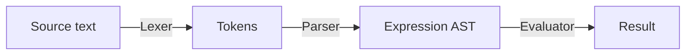

# GoTiny

A tiny programming language implemented in Go.

It currently only supports integer arithmetic expressions and an interactive REPL.

## Examples

```
> 3 * (1729 - 1712)
51

> 123 + 4 * (3 - 2)
127

> 20 / 5 / 3
1

> -(2 + 3) * -5
25

> 1712 +-1729
-17
```

## Architecture



The interpreter is currently split into these components:

- **Lexer:** converts source text into tokens.
- **Parser:** converts tokens into an expression AST.
- **AST:** represents the structure of expressions.
- **Evaluator:** evaluates an AST.
- **REPL:** provides an interactive interface to evaluate expressions from source text.

## Features

- Integer Literals
- Unary `+` and `-` (i.e. the sign operators)
- Addition and Subtraction
- Multiplication and Integer Division
- Parenthesized expressions
- Operator precedence
- Interactive REPL

## Status

Early development. GoTiny is currently a small integer expression interpreter and will be expanded gradually.
