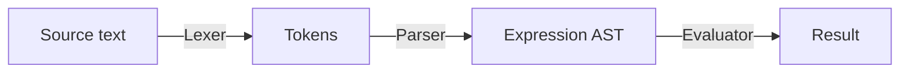

# GoTiny

A tiny programming language implemented in Go.

It currently only supports integer arithmetic expressions, variable declarations, and an interactive REPL.

## Examples

### 1. Numerical Expressions

```
> 3 * (1729 - 1712);
51
> 123 + 4 * (3 - 2);
127
> 20 / 5 / 3;
1
> -(2 + 3) * -5;
25
> 1712 +-1729;
-17
```

### 2. Variables

```
> let x = 1712;
<nil>
> let y = -1729;
<nil>
> x + y;
-17
> x = 1729;
<nil>
> x + y;
0
> y = y + 1205; y;
-524
```

A variable must be declared before it can be used. Variables cannot currently be reassigned.

```
> let x = 1729;
<nil>
> let x = 1712;
Error: variable x already defined
> z = 10;
Error: undefined variable: z
```

Variables cannot be assigned a value of a different type.

```
> let x = true; x;
true
> x = 1712;
Error: cannot assign IntType value to BoolType variable
```

Cannot use the arithmetic operations with BoolType.

```
> let x = true; x;
true
> x + 1712;
Error: binary operator "+" cannot be applied to BoolType and IntType
> -x;
Error: unary operator "-" cannot be applied to BoolType
```

### 3. Multiple Statements

```
> let x = 1205; let y = 1013; x - y;
192
```

## Architecture



The interpreter is currently split into these components:

- **Lexer:** converts source text into tokens.
- **Parser:** converts tokens into an AST.
- **AST:** represents programs containing expressions and statements.
- **Evaluator:** evaluates program.
- **Environment:** stores variable bindings.
- **REPL:** provides an interactive interface to evaluate expressions from source text.

## Features

- Integer Literals
- Unary `+` and `-` (i.e. the sign operators)
- Addition and Subtraction
- Multiplication and Integer Division
- Parenthesized expressions
- Operator precedence
- Variable declarations with `let`
- Variable assignment with type checking
- Duplicate variable handling
- Multiple statements
- Interactive REPL

## Status

Early development.

GoTiny is currently a small integer language with arithmetic expressions, variable declarations, and an interactive REPL. It will be expanded gradually.
