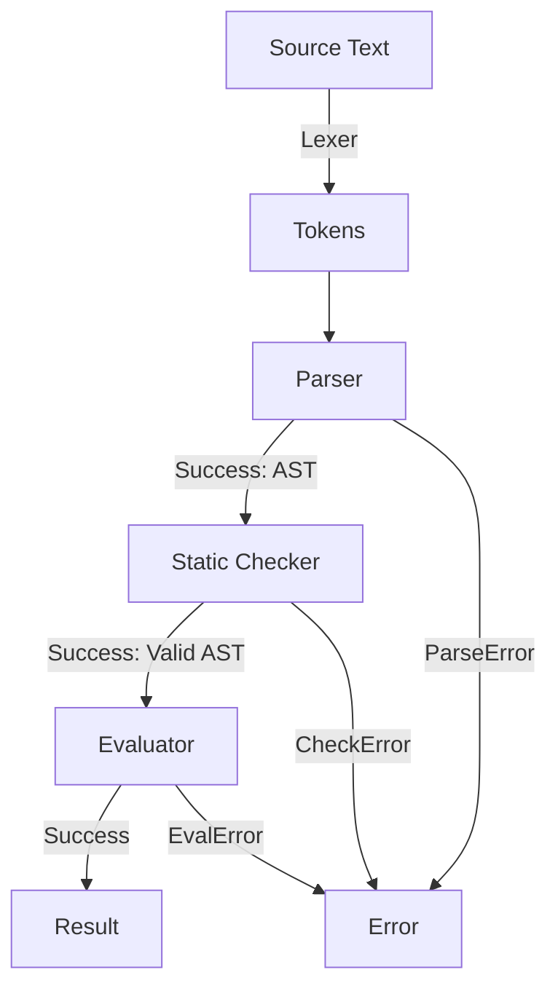

# GoTiny

A tiny statically-typed programming language implemented in Go. It includes an interactive REPL as well the ability to run scripts.

## Language Features

### 1. Statically Typed

- **Types:** Supports `Int` and `Bool`.
- **Static Checking:** Type mismatches, undefined variables, duplicate declaration, and invalid operations
  are caught by a static checker before evaluation begins.

### 2. Operators & Precedence

Expressions follow a strict precedence hierarchy (lowest to highest):

- **Logical OR:** `||` (with short-circuit evaluation)
- **Logical AND:** `&&` (with short-circuit evaluation)
- **Equality:** `==`, `!=`
- **Comparison:** `<`, `<=`, `>`, `>=`
- **Integer Arithmetic:** `+`, `-`, `*`, `/`
- **Unary:** `+`, `-` (for integers) and `!` (for booleans)
- **Primary:** Integer literals, boolean literals, identifiers, and grouped expressions `(...)`

### 3. Variables & Scope

- **Declarations:** Variables are declared using the `let` keyword (e.g., `let x = 1712;`)
- **Assignment:** Existing variables can be reassigned (e.g. `x = 1729;`).
- **Type-safe assignment::** Variables cannot be reassigned a value of a different type.
- **Declaration Scope:** Duplicate declarations in the same scope are rejected by the static checker.
- **Type Environment:** The static checker maintains a separate environment that maps variables to their types.
- **Runtime Environment:** The evaluator maintains a separate environment that maps variables to their runtime values.

### 4. Diagnostics & Error Handling

Custom error types track exact line and column numbers for syntax, type, and runtime errors.

## Installation

```
go install github.com/shsiddhant/gotiny/cmd/gotiny@latest
```

## Usage

### Interactive REPL

Run without arguments to launch the REPL:

```
gotiny
```

### Executing Scripts

Pass a script file to execute it directly

```
gotiny script.gt
```

## Interactive REPL Tour

### 1. Expressions, Booleans, & Operator Precedence

```
> 3 * (1729 - 1712);
51
> 123 + 4 * (3 - 2);
127
> 20 / 5 / 3;
1
> -(2 + 3) * -5;
25
> 1712 +-1729;
-17
> 1729 > 1712 || -1729 > -1712 && !true;
true
> 1 / 0;
Error: evaluation error at line 1, column 3: division by zero
> true || 1 / 0 > 0;
true
> false && 1 / 0 == 0;
false
```

The last two examples demonstrate short-circuit evaluation: the right-hand side
is not evaluated when the result is already determined.

### 2. Variables & Multiple Statements

```
> let x = 1712; let y = -1729; x + y;
-17
> y = y + 1205; y;
-524
```

### 3. Error Diagnostics

**Parse / Syntax Error**

```
> 3 * (1 + ;
Error: parse error at line 1, column 10: expected expression, got SemiColon
```

**Static Type Check**

```
> 1 + true;
Error: check error at line 1, column 3: binary operator "+" cannot be applied to IntType and BoolType
> true > false;
Error: check error at line 1, column 6: binary operator ">" cannot be applied to BoolType and BoolType
```

**Scope Declaration & Assignment Errors:**

```
> x + 5;
Error: check error at line 1, column 1: undefined variable: x
> let boolean = true;
<nil>
> boolean = 1712;
Error: check error at line 1, column 1: cannot assign IntType value to BoolType variable
> let boolean = false;
Error: check error at line 1, column 5: variable boolean already defined
```

## Architecture



The interpreter is currently split into these components:

- **Lexer:** converts source text into tokens.
- **Parser:** converts tokens into an AST.
- **AST:** represents programs containing expressions and statements.
- **Static Checker:** enforces strict type boundaries, duplicate declarations, and scoping rules prior to execution.
- **Type Environment:** tracks the declared type of each variable during static checking.
- **Evaluator:** evaluates the AST after static checking succeeds.
- **Environment:** stores the current runtime value of each variable during evaluation.
- **REPL:** provides an interactive interface to evaluate expressions from source text.

## Roadmap

- [ ] Block-level scoping
- [ ] If/Else
- [ ] Functions
