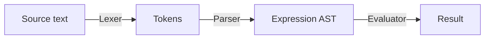

# GoTiny

A tiny programming language implemented in Go.

It currently only supports integer arithmetic expressions, variable declarations, and an interactive REPL.

## Examples

### 1. Numerical Expressions

```
> 3 * (1729 - 1712)
51
> 123 + 4 * (3 - 2)
127
> 20 / 5 / 3
1
> -(2 + 3) * -5
25
> 1712 +-1729
-17
```

### 2. Variables

```
> let x = 1712
0
> let y = -1729
0
> x + y
-17
> let y = 1729
Error: variable y already defined
> x + z
Error: undefined variable: z
```

A variable must be declared before it can be used. Variables cannot currently be reassigned.

## Architecture



The interpreter is currently split into these components:

- **Lexer:** converts source text into tokens.
- **Parser:** converts tokens into an AST.
- **AST:** represents expressions and statements.
- **Evaluator:** evaluates expressions and statements.
- **Environment:** stores variable bindings.
- **REPL:** provides an interactive interface to evaluate expressions from source text.

## Features

- Integer Literals
- Unary `+` and `-` (i.e. the sign operators)
- Addition and Subtraction
- Multiplication and Integer Division
- Parenthesized expressions
- Operator precedence
- Variable declarations with `let`
- Duplicate variable handling
- Interactive REPL

## Status

Early development.

GoTiny is currently a small integer language with arithmetic expressions, variable declarations, and an interactive REPL. It will be expanded gradually.
