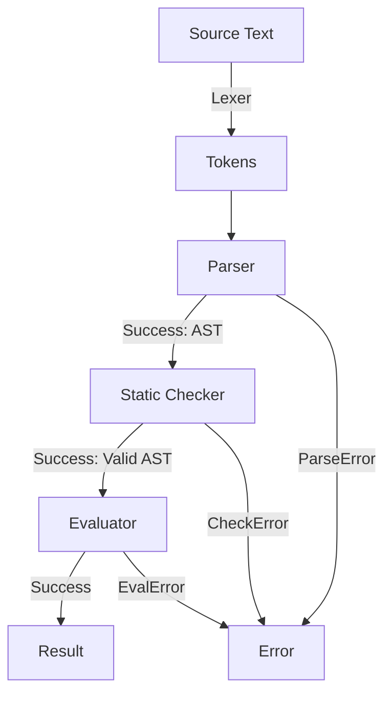

# GoTiny

A tiny statically-typed programming language implemented in Go. GoTiny programs can be written as
scripts and executed directly, with an interactive REPL available for experimenting with
expressions and statements.

## Language Features

### 1. Statically Typed

- **Types:** Supports `Int` and `Bool`, and function types
- **Static Checking:** Type mismatches, undefined variables, duplicate declarations,
  invalid operations, and invalid function calls are detected before evaluation begins.
- **Function Types:** Function types can be used as parameter and return types, and are checked
  structurally during static checking.

### 2. Operators & Precedence

Expressions follow a strict precedence hierarchy (lowest to highest):

- **Logical OR:** `||` (with short-circuit evaluation)
- **Logical AND:** `&&` (with short-circuit evaluation)
- **Equality:** `==`, `!=`
- **Comparison:** `<`, `<=`, `>`, `>=`
- **Addition/Subtraction:** `+`, `-`
- **Multiplication/Division:** `*`, `/`
- **Unary:** `+`, `-` (for integers) and `!` (for booleans)
- **Primary:** Integer literals, boolean literals, identifiers, and grouped expressions `(...)`

### 3. Variables & Scope

- **Declarations:** Variables are declared using the `let` keyword (e.g., `let x = 1712;`)
- **Assignment:** Existing variables can be reassigned (e.g. `x = 1729;`).
- **Type-safe assignment:** Variables cannot be reassigned a value of a different type.
- **Scope:** Blocks introduce a new scope.
- **Duplicate declarations:** A variable cannot be declared twice in the same scope.
- **Lexical scope:** Functions capture the environment in which they are declared,
  allowing closures to access variables from their surrounding scope.

### 4. Comments

GoTiny supports single-line comments using `#`. A comment can start anywhere on a line and extends to the end of that line.

```gt
# This is a comment
let x = 1712; # Comments can also follow code
```

### 5. Functions

Functions can be declared with typed parameters and a return type:

```gt
fn add(x Int, y Int) Int {
    return x + y;
}
```

Function types use the fn syntax and can appear wherever a type is expected:

```gt
fn apply(f fn(Int) Int, x Int) Int {
    return f(x);
}
```

Functions support:

- **Parameters:** Functions can accept typed parameters.
- **Return values:** Functions return values using the return statement.
- **Function calls:** A function call is an expression whose type is the function's declared return type.
- **Function values:** Functions can be passed as arguments and returned from other functions.
- **Void functions:** Functions without a return value have a Void return type.
- **Closures:** Functions capture their lexical environment and can access variables from their enclosing scope.
- **Recursion:** Functions can call themselves recursively.
- **Nested returns:** Return statements propagate through nested blocks until the function returns.

## Installation

```
go install github.com/shsiddhant/gotiny/cmd/gotiny@latest
```

## VS Code

A small VS Code extension with basic GoTiny syntax highlighting and
comment support is available separately:

https://github.com/shsiddhant/gotiny-language-support

## Usage

### Executing Scripts

Pass a script file to execute it directly:

```
gotiny script.gt
```

The repository includes several example programs in the scripts directory.
The main showcase is:

`scripts/v0.4.0/fibonacci_closure.gt`

```gt
# fibonacci returns a function that produces the Fibonacci sequence
# one by one: 1, 1, 2, 3, 5, ...
fn fibonacci() fn() Int {
    let current = 0;
    let next = 1;

    # genNext captures and updates current and next, preserving its state between calls.
    fn genNext() Int {
        let newNext = current + next;
        current = next;
        next = newNext;
        return current;
    }
    return genNext;
}

let f = fibonacci();

print f(); # 1
print f(); # 1
print f(); # 2
print f(); # 3
print f(); # 5
print f(); # 8
print f(); # 13
print f(); # 21
f(); # Result of the program is the 9th fibonacci number: 34
```

This produces:

```
1
1
2
3
5
8
13
21
34
```

The returned function is a closure that retains access to the mutable current and next
variables from its enclosing function.

Another example demonstrates passing functions as arguments and returning closures:

`scripts/v0.4.0/function_scale.gt`

```gt
fn scaleFunction(
    s Int,
    g fn(Int) Int
) fn(Int) Int {
    fn scaled (y Int) Int {
        return s * g(y);
    }
    return scaled;
}

let s = 3;
fn base(n Int) Int {
    return n;
}

let scaled = scaleFunction(s, base);
scaled(1712);
```

This produces:

```
5136
```

The repository contains additional example scripts that you can try out.

### Interactive REPL

Run without arguments to launch the REPL:

```
gotiny
```

The REPL is useful for experimenting with expressions and individual statements:

```

> 3 * (1729 - 1712);
> 51
> 123 + 4 * (3 - 2);
> 127
> 20 / 5 / 3;
> 1
> -(2 + 3) * -5;
> 25
> 1712 +-1729;
> -17
> 1729 > 1712 || -1729 > -1712 && !true;
> true
> 1 / 0;
> Error: evaluation error at line 1, column 3: division by zero
> true || 1 / 0 > 0;
> true
> false && 1 / 0 == 0;
> false

```

The last two examples demonstrate short-circuit evaluation: the right-hand side
is not evaluated when the result is already determined.

**Note:** The REPL currently evaluates one complete input at a time and does not support multi-line input.
For larger programs and multi-line function declarations, use a script file.

## Diagnostics & Error Handling

Custom error types track exact line and column numbers for syntax, type, and runtime errors.

**Parse / Syntax Error**

```

> 3 * (1 + ;
> Error: parse error at line 1, column 10: expected expression, got SemiColon

```

**Static Type Check**

```

> 1 + true;
> Error: check error at line 1, column 3: binary operator "+" cannot be applied to IntType and BoolType
> true > false;
> Error: check error at line 1, column 6: binary operator ">" cannot be applied to BoolType and BoolType
> fn isNonNegative(x Int) Bool { if x > 0 { return true;}}
> Error: check error at line 1, column 4: missing return statement at end of function "isNonNegative"

```

**Scope Declaration & Assignment Errors:**

```

> x + 5;
> Error: check error at line 1, column 1: undefined name: x
> let boolean = true;
> boolean = 1712;
> Error: check error at line 1, column 1: cannot assign IntType value to BoolType variable
> let boolean = false;
> Error: check error at line 1, column 5: name already defined: boolean

```

## Architecture



The interpreter is currently split into these components:

- **Lexer:** converts source text into tokens.
- **Parser:** converts tokens into an AST.
- **AST:** represents programs containing expressions and statements.
- **Static Checker:** enforces type boundaries, duplicate declarations, function signatures,
  argument types, and scoping rules before execution.
- **Type Environment:** tracks the declared type of each variable and function during static checking.
- **Evaluator:** evaluates the AST after static checking succeeds.
- **Environment:** stores runtime values and lexical parent environments during evaluation.
- **REPL:** provides an interactive interface for evaluating complete statements and expressions.

## Roadmap

- [x] Block-level scoping
- [x] If/Else
- [x] Functions
  - [x] Function parameters and return values
  - [x] Closures
  - [x] Recursion
  - [x] Functions as parameters and return values
- [x] Comments
- [x] Print statement
- [ ] While loops
- [ ] Strings

## License

This project is licensed under the [MIT License](LICENSE).
